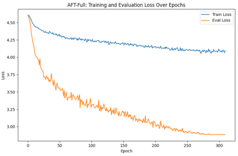
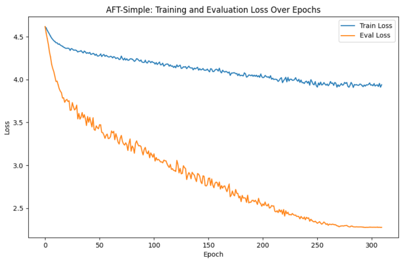
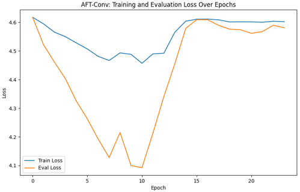
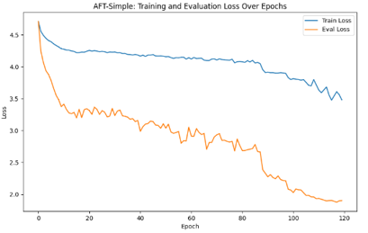
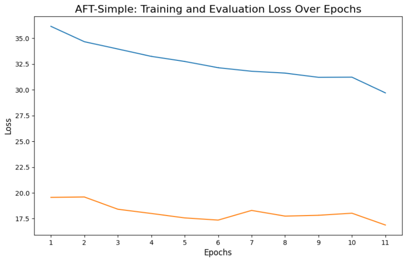

# 2024 X-Team夏令营考核

模型训练的结果保存在[huggingface](https://huggingface.co/horiki/2024X-TeamSummarCamp)中。

一些实现细节记录在以下博客中：
1. [2024年X-Team夏令营考核任务1实现](https://zhouzimu.top/2024/07/25/2024%E5%B9%B4X-Team%E5%A4%8F%E4%BB%A4%E8%90%A5%E8%80%83%E6%A0%B8%E4%BB%BB%E5%8A%A11/)
2. [2024年X-Team夏令营考核任务2实现](https://zhouzimu.top/2024/07/26/2024%E5%B9%B4X-Team%E5%A4%8F%E4%BB%A4%E8%90%A5%E8%80%83%E6%A0%B8%E4%BB%BB%E5%8A%A12/)

考虑到Windows环境中代码拷贝到Liunx环境中可能会出现换行不一致等问题，可以去[代码仓库](https://github.com/NoyeArk/X-Team-2024SummarCamp)克隆代码。

## 1 任务1

任务要求：实现aft-full/simple/conv，用它们替换metaformer中的tokenmixer部分，并在cifar100上进行训练。

### 1.1 AFT代码复现

在任务1中复现了适用于metaformer的aft-full/simple/conv，具体见[AFT代码复现](metaformer/aft)。

### 1.2 CIFAR100数据集加载

加载数据集通过指定[train.py](metaformer/train.py)中的create_dataset函数中数据集名称来进行加载：

```python
args.dataset = "torch/CIFAR100"
args.dataset_download = True

dataset = create_dataset(
    args.dataset, root=args.data_dir, split=args.train_split, is_training=True,
    class_map=args.class_map,
    download=args.dataset_download,
    batch_size=args.batch_size,
    repeats=args.epoch_repeats
)
```

### 1.3 开始训练

如果要运行修改后的metaformer，请执行以下命令：

```bash
CODE_PATH=/path/to/code/metaformer
MODEL_NAME="model_name"  # aftsimple、aftfull和aftconv

ALL_BATCH_SIZE=256
NUM_GPU=1
GRAD_ACCUM_STEPS=1  # 根据你的GPU数量和内存进行调整

let BATCH_SIZE=ALL_BATCH_SIZE/NUM_GPU/GRAD_ACCUM_STEPS

cd $CODE_PATH && sh distributed_train.sh $NUM_GPU \
--models $MODEL_NAME --opt lamb --lr 8e-3 --warmup-epochs 20 \
-b $BATCH_SIZE --grad-accum-steps $GRAD_ACCUM_STEPS \
--drop-path 0.6 --head-dropout 0.5
```

其中CODE_PATH配置为metaformer的代码路径，MODEL_NAME应该为要配置的AFT变体：
1. aftsimple
2. aftfull
3. aftconv

模型训练的结果会保存在metaformer目录下的output目录中。

### 1.4 实验结果

在复现的过程中，一开始由于模型的参数过多，导致每次保存的权重很大。

之后为了解决这个问题，就把模型改的很小进行训练，但是由于训练的结果不是很好：300轮中最好的Top1精度也只有45%，之后才发现由于模型过小。

当把模型的大小调整到s12大小时，130轮就达到了52%的精度，具体结果如下：

| 模型名称        | Depths       | Dims                | Epochs | Top-1 | Top-5 |
|-------------|--------------|---------------------|--------|-------|-------|
| AFT-Simple1 | [1, 1, 2, 1] | [8, 16, 16, 16]     | 300    | 46%   | 77%   |
| AFT-Simple2 | [2, 2, 4, 2] | [64, 128, 320, 512] | 120    | 52%   | 82%   |
| AFT-Full1   | [1, 1, 2, 1] | [8, 16, 16, 16]     | 300    | 31%   | 64%   |
| AFT-Full2   | [2, 2, 4, 2] | [64, 128, 320, 512] | 70     | 40%   | 70.3% |
| AFT-Conv1   | [1, 1, 2, 1] | [8, 16, 16, 16]     | 24     | 9.4%  | 28.7% |
| AFT-Conv2   | [2, 2, 4, 2] | [64, 128, 320, 512] | 15     | 12.9% | 36.5% |

每个模型的最好权重保存在[models](metaformer/result/models)中。

训练模型Loss变化过程如下：

<center></center>
<center>图1.1 AFT-Full1训练Loss变化</center>

<center></center>
<center>图1.2 AFT-Simple1训练Loss变化</center>

<center></center>
<center>图1.3 AFT-Conv1训练Loss变化</center>

<center></center>
<center>图1.4 AFT-Simple2训练Loss变化</center>

---
## 2 任务2

### 2.1 AFT代码复现

在任务2中复现了适用于DINO的AFT-Full/Simple/Conv，具体见[AFT代码复现](DINO/models/aft)。

其中AFT-Full不太适合在ExDark数据集上进行训练，因为ExDark数据集中的图片较大，将输入的H×W继续reshape之后得到的T太大，会OOM。

因此只训练了AFT-Simple和AFT-Conv。

### 2.2 ExDark数据集加载

由于ExDark数据集没有内置数据集，因此只能本地加载，从官网下载[ExDark数据集](https://github.com/cs-chan/Exclusively-Dark-Image-Dataset)，

下载之后的数据集内部目录如下：

```txt
├─ExDark
│  ├─Bicycle
│  ├─Boat
│  ├─Bottle
│  ├─Bus
│  ├─Car
│  ├─Cat
│  ├─Chair
│  ├─Cup
│  ├─Dog
│  ├─Motorbike
│  ├─People
│  └─Table
```

其中每个类别文件中都是源图片，因此需要对数据集进行预处理得到目标检测需要的检测区域、标签等信息。

这里是将所有用作训练集的图片的信息都生成在一个[json文件](DINO/ExDark/annotations/instances_train2017.json)中，测试集图片的相关信息同样生成在一个[json文件](DINO/ExDark/annotations/instances_val2017.json)中。

这里的json文件中内容的设计采用和Coco数据集相同的形式，因为这么做可以直接使用加载Coco数据集的代码来加载ExDark数据集，只不过加载的内容不同。

数据预处理的代码见[数据预处理](DINO/datasets/split_dataset_json.py)。

### 2.3 开始训练

在开始训练之前，要先运行以下命令编译CUDA算子：

```sh
cd models/dino/ops
python setup.py build install
python test.py
```

编译成功之后，如果要运行将backbone修改为AFT-Simple的DINO，执行以下命令：

```bash
dataset_path=/DINO/DINO/ExDark/

python main.py \
	--output_dir logs/DINO/summary -c config/AFT/aft_simple.py --coco_path $dataset_path \
	--dataset_file=coco --options dn_scalar=100 embed_init_tgt=TRUE \
	dn_label_coef=1.0 dn_bbox_coef=1.0 use_ema=False \
	dn_box_noise_scale=1.0
```

若要运行AFT-Conv，请将上述脚本中的`-c config/AFT/aft_simple.py`改为`-c config/AFT/aft_conv.py`

模型训练的结果会保存在logs/DINO目录下的result目录中。

### 2.4 实验结果

实验结果如下，可以看到训练结果并不是很好，咨询了学长，可能是由于DINO缺少预训练的原因。

| 模型名称       | Epochs | Map    |
|------------|--------|--------|
| AFT-Simple | 12     | 0.085% |
| AFT-Conv   | 12     | 0.075% |

训练模型Loss变化：

<center></center>
<center>图2.1 AFT-Simple训练Loss变化</center>

<center></center>
<center>图2.2 AFT-Conv训练Loss变化</center>
